### These steps will be followed for the experiment

**PRE EXPERIMENT TASK**

1) What is high frequency mode?
2) What is LCR meter?
3) What is conductance signature?
4) What is conductance?
5) What is susceptance?

Click on start experiment button to start the experiment. 
 
Step-1: (a) Click on add button to bring a stand. 
 
Step-1: (b) Click on add button to bring aluminium bar. 
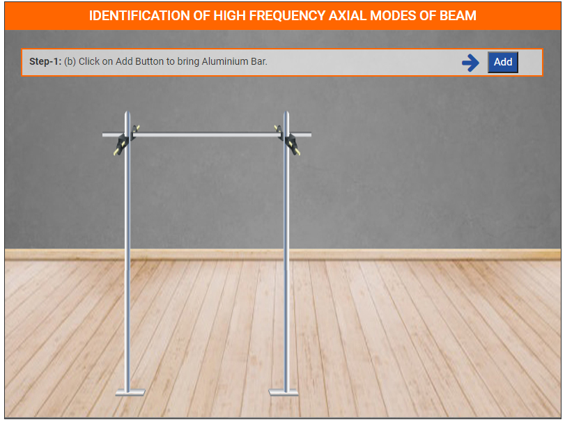 
Step-1: (c) Click on add button to bring paper cutter and tap. 
 
Step-1: (d) Click on Tap to stick it on aluminium bar. 
 
Step-1: (e) Click on paper cutter to cut the tap. 
 
Step-1: (f) Click on tap to place it back to its original position. 
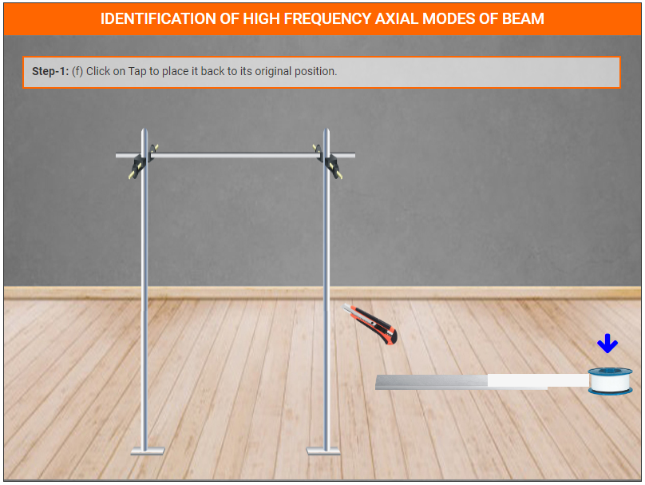 
Step-1: (g) Click on add button to bring a PZT Patch. 
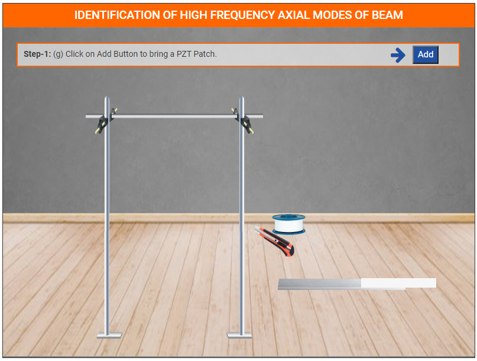 
Step-1: (h) Click on add button to bring bond. 
 
Step-1: (i) Click on brush to apply bond on aluminium bar. 
 
Step-1: (j) Click on PZT patch to place it on aluminium bar. 
 
Step-1: (k) Click on next button. 
 
Step-2: (a) Click on add button to bring soldering rod. 
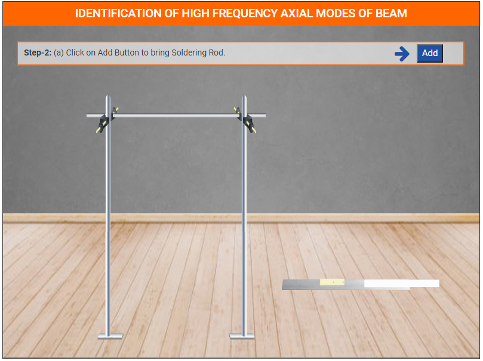 
Step-2: (b) Click on add button to bring wires.  
 
Step-2: (c) Click on wire to attach it with PZT patch.  
 
Step-2: (d) Click on another wire to attach it with PZT patch.  
 
Step-2: (e) Click on PZT patch to see the zoom view of it. 
 
Step-2: (f) Click on soldering rod for soldering the wires. 
 
Step-2: (g) Click on next button. 
 
Step-3: (a) Click on add button to bring a PZT patch. 
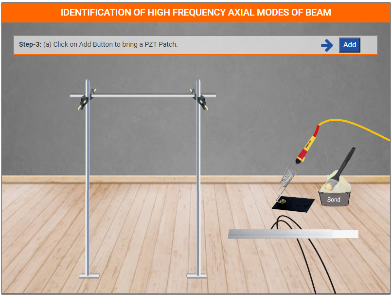 
Step-3: (b) Click on brush to apply bond on aluminium bar. 
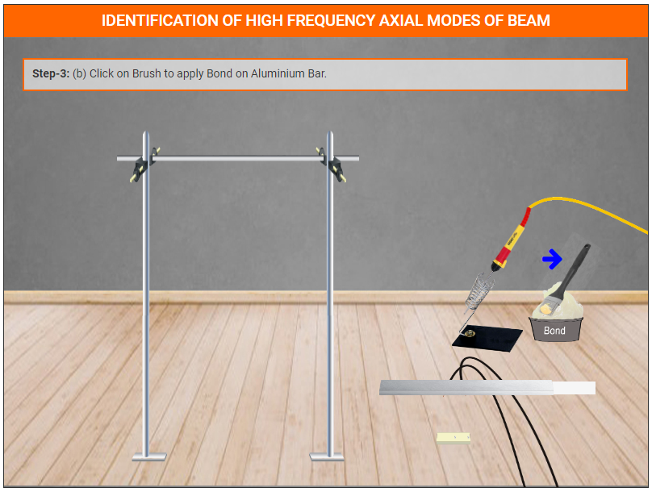 
Step-3: (c) Click on PZT patch to place it on aluminium bar. 
 
Step-3: (d) Click on add button to bring wires. 
 
Step-3: (e) Click on wire to attach it with PZT patch. 
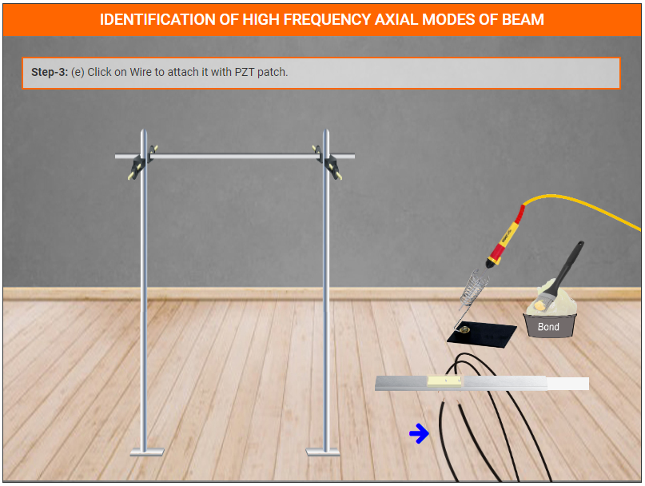 
Step-3: (f) Click on another wire to attach it with PZT patch. 
 
Step-3: (g) Click on PZT patch to see the zoom view of it. 
 
Step-3: (h) Click on soldering rod for soldering the wires. 
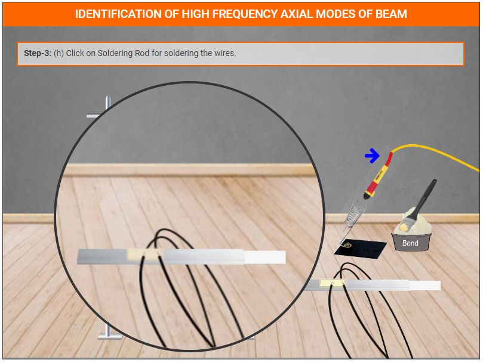 
Step-3: (i) Click on next button. 
 
Step-4: (a) Click on add button to bring LCR. 
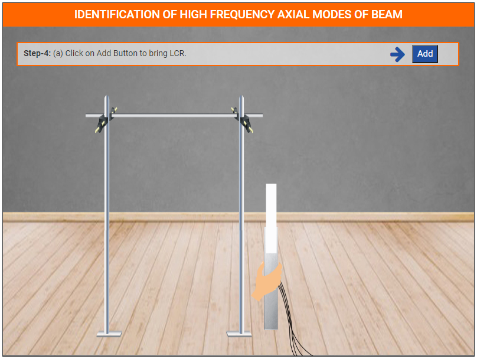 
Step-4: (b) Click on aluminium bar to hanging it on the stand. 
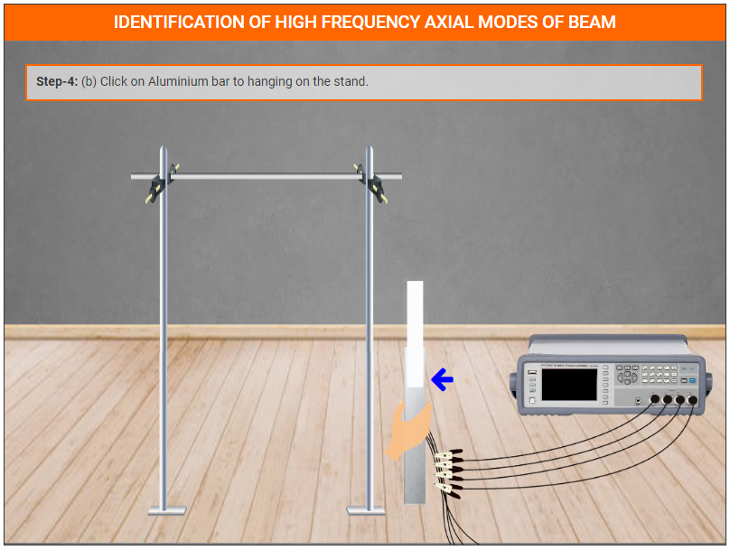 
Step-4: (c) Click black pins one by one to attach them with PZT patch wires. 
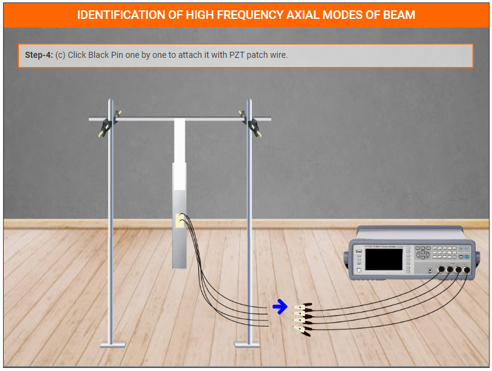 
Step-4: (d) Now switch on the power button of LCR meter. 
 
Step-4: (e) Click on next button. 
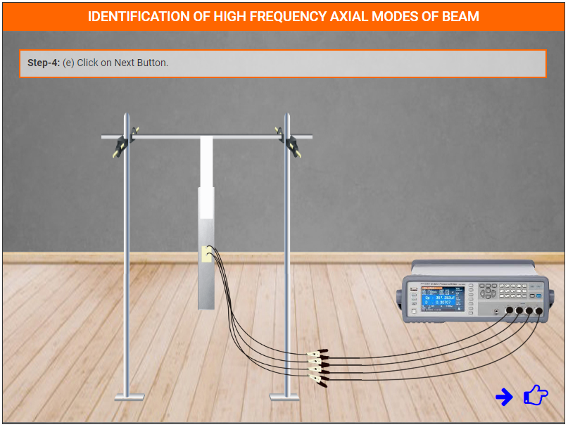 
Step-5: (a) Select the values and click on submit buttton. 
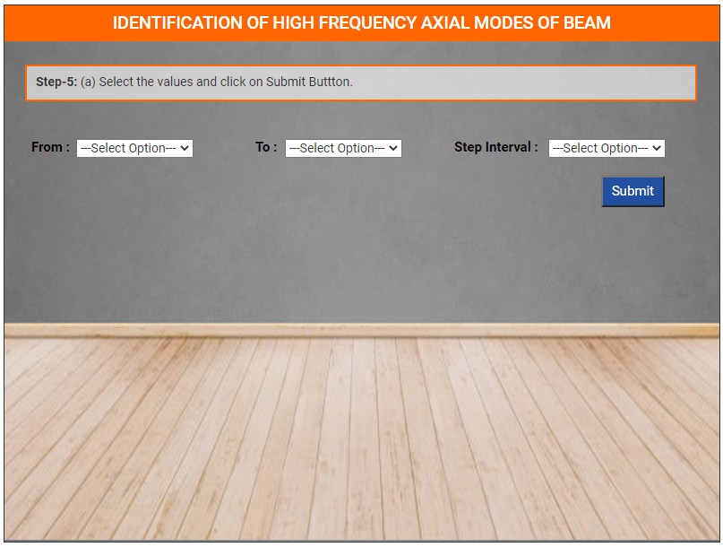 
Step-5: (b) Click on ok button. 
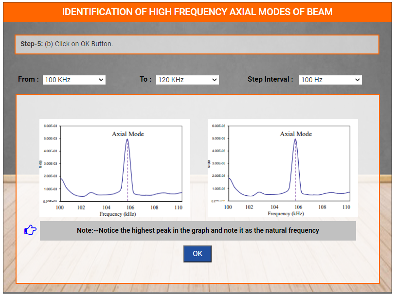 
Step-5: (c) Click on next button. 
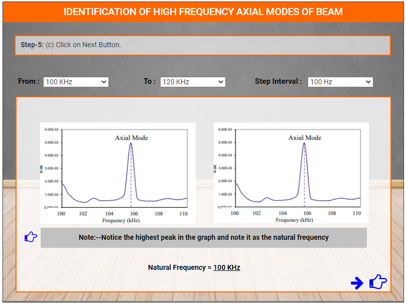 
Step-6: Calculate the natural frequency as per the theoritical formula given below: 

Click on restart button. 
 
 

**POST EXPERIMENT TASK**

1) Plot graph of conductance v/s frequency in MS Excel.
2) Calculate resonant frequency of the beam from the above plot.
3) From the plot, identify the natural frequency of the beam and compare the frequency obtained with theoretical frequency. 
