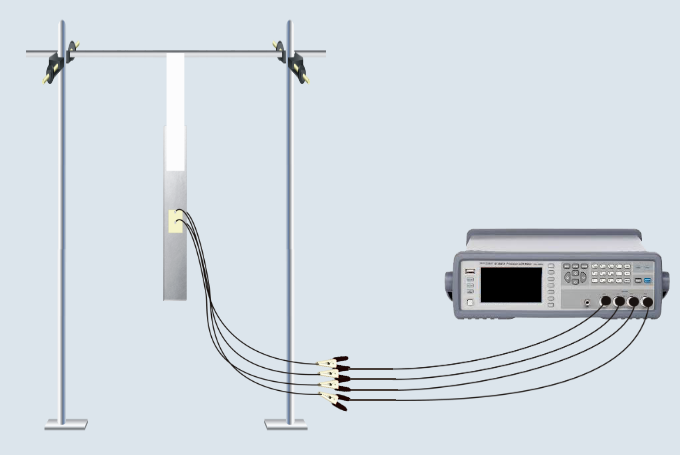
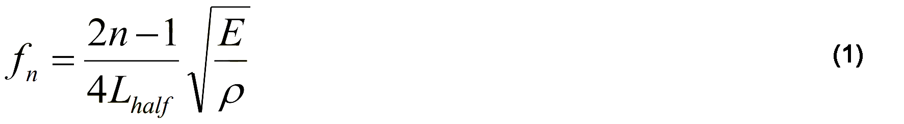

### Theory

This experimental setup is shown in Fig. 1. It consists of an aluminium beam of dimensions 299 × 18.2 × 2.15 mm with a pair PZT sensors bonded on either side of the beam at the midpoint as shown in the figure. “Free-free” conditions are ensured by hanging the beam vertically through a cello tape, whose high flexibility ensure “free-free” conditions. The two PZT patches are connected with each other such that the positive electrode of one patch joins the positive electrode of the other, so that they are excited in phase when an alternating voltage is applied across the combination. The wires from the combination are connected to Agilent E4980 LCR meter which is in turn connected to the LAN port and thus accessible to the user through the internet/intranet. In this arrangement, only axial vibrations are induced and flexural vibrations are ruled out.

The user may acquire the plots of the conductance (G) and the susceptance (B) against frequency using the LCR meter. The VEE PRO based interactive dialogue box available in the main page of the experiment (for more details <a href="http://ssdl.iitd.ac.in/vssdl/exp2.html">click here</a>) can be used for this purpose. A frequency range of 100 kHz to 110 kHz at an interval of 100 Hz is recommended. The dialogue box stores frequency, G and B in the computer of the user. Plots are also available in the VEE PRO dialogue box.

Fig. 1 Experimental set up

The user may plot G v/s frequency in excel. The peak in the plot is the resonance frequency of the beam. Following plot is expected if the experiment is correctly performed.

Fig. 2 Expected plot of G vs frequency.

From the frequency plot, the user can identify the natural frequency of the beam in axial mode as the
frequency corresponding to which peak in the G-plot. The user may compare the frequency obtained
through this experiment with the theoretical frequency given below (Paz, 2004). 

where E denotes the Young's modulus of elasticity of the beam, ρ the material density and Lhalf the half length of the beam. The user may compute the first ten frequencies by substituting n = 1, 2..., 10 and conclude as to which frequency is identified. 

