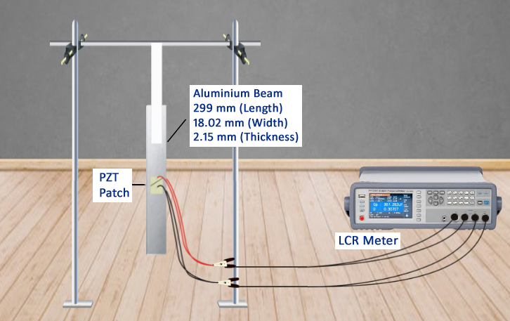

### Theory

This virtual experiment simulates application of the EMI technique in identifying high frequency modes of miniature structures otherwise not possible using low frequency external excitations induced through hammer and shakers. The simulated experimental setup is as shown in Fig. 1. It consists of an aluminium beam of dimensions 299 × 18.2 × 2.15 mm with a pair of piezo ceramic (PZT) sensor bonded on either side of the beam at the midpoint as shown in the figure. “free-free” condition is ensured by hanging the beam vertically through a cello tape, whose high flexibility ensure “free-free” condition. The two PZT patches are connected with each other such that the positive electrode of one patch connect the positive electrode of the other, so that they are excited in phase when an alternating voltage is applied across the combination. The wires from the combination are connected to LCR meter. In this arrangement, only axial vibrations are induced and flexural vibrations are ruled out.
The user may acquire the plots of the conductance (G) and the susceptance (B) against frequency using the LCR meter. The dialogue box enables downloading the time and the frequency domain data in the computer of the user.

Following plot is expected if the experiment is correctly performed replaced by Typical plot shall be as shown in Fig 2.

Fig. 1 Experimental set up

The user may plot G v/s frequency in excel. The peak in the plot is the resonance frequency of the beam. Following plot is expected if the experiment is correctly performed.

Fig. 2 Expected plot of G vs frequency.

From the frequency plot, the user can identify the natural frequency of the beam in axial mode as the
frequency corresponding to which peak in the G-plot. The user may compare the frequency obtained
through this experiment with the theoretical frequency given below (Paz, 2004). 

where <i>E</i> denotes the Young's modulus of elasticity of the beam, <i>ρ</i> the material density and <i>Lhalf</i> the half length of the beam. The user may compute the first ten frequencies by substituting <i>n</i> = 1, 2..., 10 and conclude as to which frequency is identified. 
